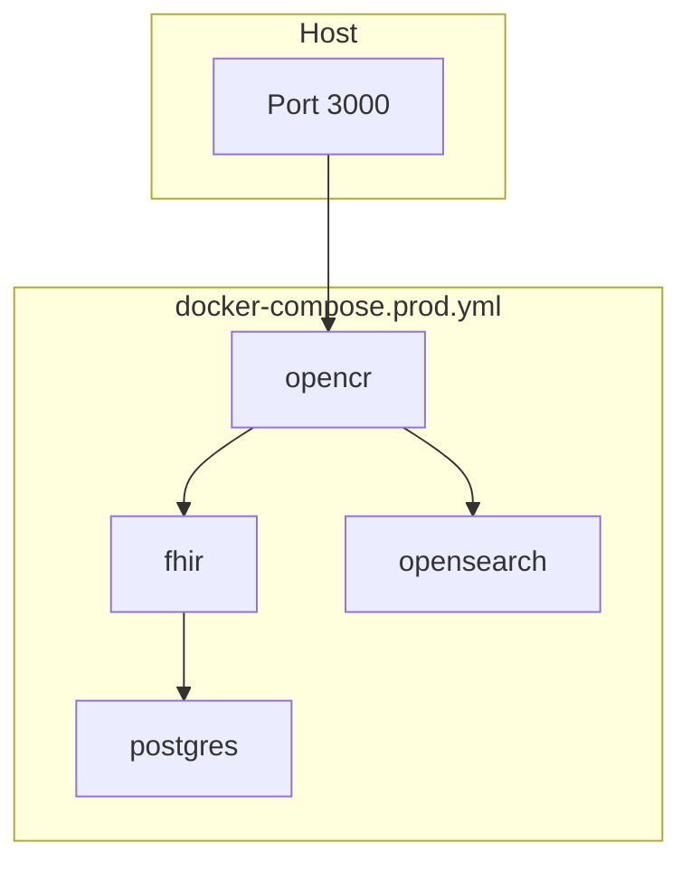

# Production Installation using Docker

!!! note "Time to complete"
    30–60 Minutes

!!! warning
    This guide is for single-server production deployments. For local demos, evaluation, or development, use the [local Docker guide](docker.md) instead.

This guide deploys the full OpenCR platform with Docker Compose:

- **OpenCR** — client registry service and UI
- **HAPI FHIR** — FHIR R4 server for patient records and audit events
- **PostgreSQL** — persistent database for HAPI FHIR
- **OpenSearch** — record linkage and search (with required plugins)

The OpenCR and OpenSearch containers are pulled from Docker Hub ([`daviemukungi/opencr`](https://hub.docker.com/r/daviemukungi/opencr), [`daviemukungi/opensearch`](https://hub.docker.com/r/daviemukungi/opensearch)). HAPI FHIR and PostgreSQL use public images and are defined in [`docker-compose.prod.yml`](../../docker-compose.prod.yml) alongside OpenCR.

For a summary of what was added and how images are tagged, see the [deployment changelog](deployment-changelog.md).

## Prerequisites

- Linux server with Docker Engine and Docker Compose v2
- **32 GB RAM** recommended for light production loads ([system requirements](requirements.md))
- Git clone of this repository on the server
- Network access to pull images from Docker Hub

## Before you start

1. Copy environment variables and set secrets:

```sh
cp .env.prod.example .env
```

Edit `.env` and set at minimum:

- `POSTGRES_PASSWORD` — strong password for the HAPI FHIR database
- `OPENCR_IMAGE_TAG` — OpenCR image tag to deploy (default: `20260625-4bea9e2`)
- `OPENSEARCH_IMAGE_TAG` — OpenSearch image tag to deploy (default: `20260625-4bea9e2`)

2. Copy and customize the OpenCR production config:

```sh
cp server/config/config_production_docker_template.json server/config/config_production.json
```

Edit `server/config/config_production.json` before go-live:

- `auth.secret` — generate a new random UUID
- `fhirServer.password` — match `POSTGRES_PASSWORD` in `.env` if you change the database password
- `clients` and `systems.internalid.uri` — match your submitting systems (add your own identifier URIs; no patient records are shipped with this compose file)
- `mediator` settings — if using OpenHIM in production

!!! note "No patient data in this deployment"
    The production Docker Compose stack and config template contain **no patient records**. Patient data must be imported separately after deployment using your organization's approved processes. Do not commit `config_production.json` or import CSV files to version control.

!!! warning
    Do not deploy with default passwords or the template `auth.secret`. See [security](security.md).

## Start the stack

From the repository root:

```sh
docker compose -f docker-compose.prod.yml pull
docker compose -f docker-compose.prod.yml up -d
```

Pulling fetches both `daviemukungi/opencr` and `daviemukungi/opensearch` images. The first start may take a few minutes while HAPI FHIR and OpenSearch initialize.

### Verify services

```sh
docker compose -f docker-compose.prod.yml ps
```

All services should be `running`. OpenCR may take up to two minutes to pass its health check while it waits for HAPI FHIR.

View logs for a component:

```sh
docker compose -f docker-compose.prod.yml logs -f opencr
```

Components: `opencr`, `fhir`, `postgres`, `opensearch`.

### First login

Open the UI at:

[https://\<host\>:3000/crux](https://localhost:3000/crux)

Default credentials (change immediately after install):

- **Username**: `root@intrahealth.org`
- **Password**: `intrahealth`

## Architecture

Only port **3000** is published to the host by default. HAPI FHIR, PostgreSQL, and OpenSearch communicate on the internal Docker network and are not exposed externally.



Put a TLS-terminating reverse proxy (nginx, Caddy, etc.) in front of OpenCR if clients connect over the WAN. See [security](security.md).

## Upgrading OpenCR

1. Set the new tag in `.env`:

```sh
OPENCR_IMAGE_TAG=<new-date-sha-tag>
```

2. Pull and recreate the OpenCR container:

```sh
docker compose -f docker-compose.prod.yml pull opencr
docker compose -f docker-compose.prod.yml up -d opencr
```

## Upgrading OpenSearch

1. Set the new tag in `.env`:

```sh
OPENSEARCH_IMAGE_TAG=<new-date-sha-tag>
```

2. Pull and recreate OpenSearch (reindexing may be required if mappings change):

```sh
docker compose -f docker-compose.prod.yml pull opensearch
docker compose -f docker-compose.prod.yml up -d opensearch
```

Database and OpenSearch data persist in named volumes across upgrades.

## Operations

### Stop the stack

```sh
docker compose -f docker-compose.prod.yml down
```

Data in `pgdata` and `opensearch_data` volumes is retained.

### Remove everything including data

```sh
docker compose -f docker-compose.prod.yml down -v
```

!!! danger
    `-v` deletes PostgreSQL and OpenSearch volumes. Back up first.

### Backup

Back up the named Docker volumes regularly:

- `pgdata` — HAPI FHIR / PostgreSQL data
- `opensearch_data` — search index data

See [backup](backup.md) for broader backup guidance.

### Tune OpenSearch memory

Adjust `OPENSEARCH_JAVA_OPTS` in `.env` (for example `-Xms8g -Xmx8g` on a larger server), then recreate OpenSearch:

```sh
docker compose -f docker-compose.prod.yml up -d opensearch
```

## Security checklist

- Replace all default passwords and `auth.secret` before production use
- Restrict port 3000 to trusted networks or place OpenCR behind a reverse proxy with TLS
- Do not publish HAPI FHIR (8080) or OpenSearch (9200) to the public internet
- Disable or restrict the HAPI FHIR testing UI in production
- Review [security](security.md) and [configuration](configuration.md)

## Comparison with local Docker

| | Local / demo ([docker.md](docker.md)) | Production (this guide) |
|---|---|---|
| Compose file | `docker-compose.cicd.yml` | `docker-compose.prod.yml` |
| OpenCR image | built locally | `daviemukungi/opencr` from Docker Hub |
| OpenSearch image | built locally or `intrahealth/opensearch` | `daviemukungi/opensearch` from Docker Hub |
| `NODE_ENV` | `cicd` | `production` |
| Database | H2 (default) or PostgreSQL (override) | PostgreSQL (required) |
| Port exposure | all services | OpenCR only |
| Secrets | hardcoded in compose | `.env` file |

## Troubleshooting

- **OpenCR exits or restarts**: check `docker compose -f docker-compose.prod.yml logs opencr`. Ensure `config_production.json` exists and HAPI FHIR is reachable at `http://fhir:8080/fhir`.
- **OpenSearch unhealthy**: ensure the host has enough RAM for `OPENSEARCH_JAVA_OPTS`. First build can take several minutes.
- **Cannot log in**: confirm you are using `https://` (OpenCR serves TLS on port 3000).

For more issues, see [troubleshooting](troubleshooting.md).
